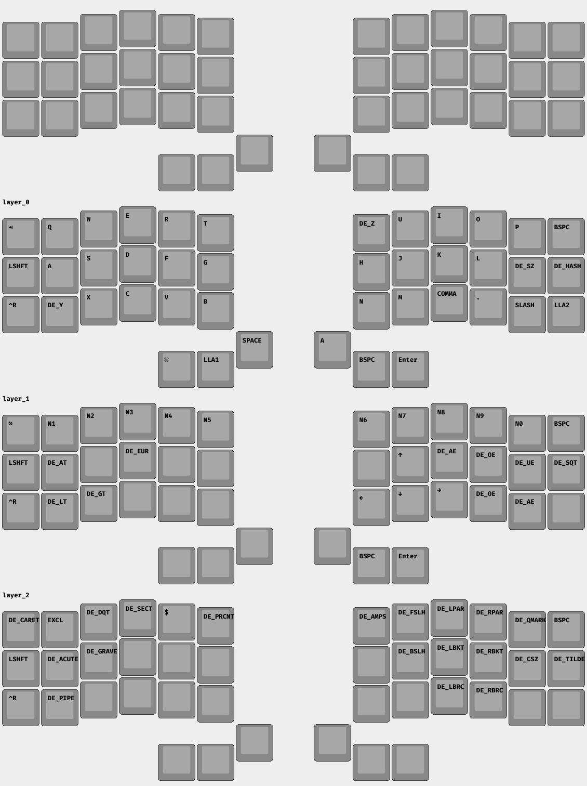

# zmk-config

- **KB:** [Corne](https://github.com/foostan/crkbd)
- **PCB:** [Aurora Corne](https://splitkb.com/products/aurora-corne)
- **Chip:** [nice!nano](https://nicekeyboards.com/nice-nano/) v2
- **Firmware:** [ZMK](https://zmkfirmware.dev)
- **Keycaps:** [Blank MKB Choc Low Profile](https://splitkb.com/products/blank-mbk-choc-low-profile-keycaps)
- **Rotary encoder:** [splitkb Knurled Metal](https://splitkb.com/products/knurled-metal-encoder-knob)

### zmk-viewer preview

https://github.com/MrMarble/zmk-viewer

`.\zmk-viewer.exe generate -f .\config\splitkb_aurora_corne.keymap "splitkb/aurora/corne/rev1" --single`

